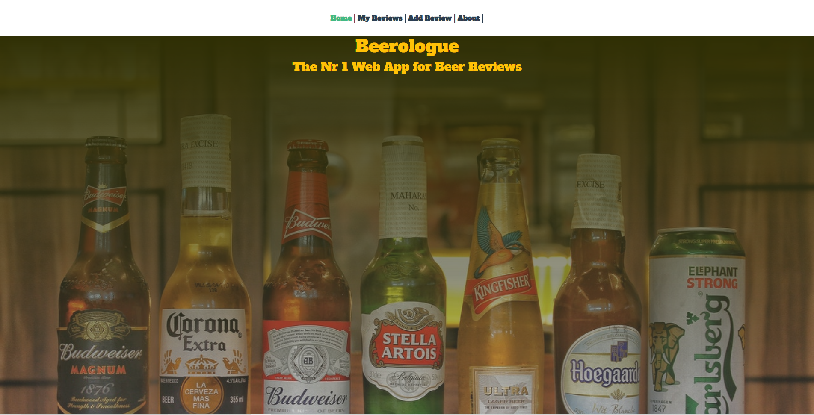

# Beerologue

### A simple Web App for Beer Reviews

## Front End

### Front End Dependencies

- VueJS2
- Vue Router
- Bootstrap Vue
- Font Awesome

## Back End

### Back End Dependencies

- Node JS
- Express
- Mongoose
- Cors

## Installation

First clone the repositiry. Then install the Vue App from frontend directory and server from backend directory.

Then write in the console

`npm install`

## Running the App

### Front End

Start the Front End with:

`npm run serve`

Start Back End with:

`node app.js`

